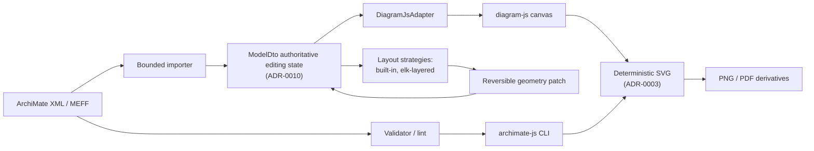
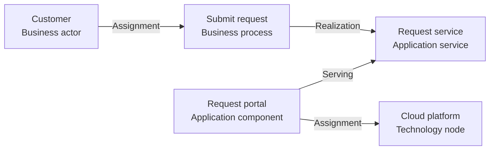

# archimate-js

A browser-based ArchiMate® diagramming library built on the [diagram-js](https://github.com/bpmn-io/diagram-js) engine from [bpmn.io](https://bpmn.io/).

ArchiMate® is a registered trademark of [The Open Group](https://www.opengroup.org/archimate-forum/archimate-overview).

See [third-party notices](THIRD_PARTY_NOTICES.md) for bundled font licenses, project provenance, and attribution.

## What is implemented today

The package is usable today as a browser viewer, an experimental browser modeler,
a bounded MEFF/XML validator, and a CI-oriented export CLI. The public package
surface is intentionally small and is listed in [`package.json`](package.json)
and [`index.js`](index.js).

| Capability | Current implementation | Important boundary |
| --- | --- | --- |
| Import and render | The root entry exports `Viewer`, `mountViewer`, and `renderViewToSvg`. Use `Viewer.importXML(xml, view?)` or `mountViewer({ xml, viewId/viewName, container })` for browser embedding, and `renderViewToSvg({ xml, viewId/viewName })` for deterministic SVG strings. | XML/MEFF support is bounded and still being characterized; see the exchange-format status below. Rendering uses a browser DOM, not a pure Node renderer. |
| Experimental modeler | `archimate-js/modeler` exports a public browser `Modeler` facade for eligible DTO editing sessions: lifecycle, content-minimized diagnostics, serializable commands, undo/redo, selection, projection, viewport helpers, save, and operation-log replay. | Stable-experimental while `0.y.z`: documented public API, but breaking changes can ship before `1.0.0`. The diagram-js capability escape hatch is explicitly unstable. |
| Model DTO authority | Eligible editing sessions keep `ModelDto` as the authoritative semantic and view state; diagram-js elements are transient projections behind `DiagramJsAdapter`. | This applies to the DTO editing profile, not every imported MEFF record. Legacy moddle save compatibility remains a convergence path. |
| Layout and routing | Root exports `routeViewConnections`, `optimizeDiagram`, and `applyLayoutPatch`; `archimate-js/layout` exposes async `layoutView`. Built-in layout and connection routing produce reversible geometry patches. `strategy: 'elk-layered'` optionally loads pinned `elkjs@0.12.0` for unlabeled compound views. | Layout is opt-in and never silently rewrites imported geometry. Unsupported ELK constraints, including labeled edges today, return diagnostics rather than falling back. |
| App shell themes and accessibility | The read-only example and app shell CSS support five choices: `default` (system preference), `light`, `dark`, `high-contrast-light`, and `high-contrast-dark`, with forced-colors and reduced-motion handling. Browser tests cover theme contrast, chooser persistence, export invariance, zoom, focus, and accessible outline behavior. | Diagram notation colors remain ArchiMate notation colors; the app shell theme frames the experience rather than redefining the standard notation palette. |
| Validator and linting | `archimate-js/validator` and `archimate-js/lint` provide bounded structure checks, deterministic diagnostics, and optional organization quality rules. The `archimate-js` CLI exposes `validate` and `lint`. | This is not full XSD validation, a complete ArchiMate semantic matrix, a conformance claim, or an automatic repair workflow. |
| Export CLI | The `archimate-js` CLI exports selected views to SVG, PNG, and PDF through an existing Chrome/Chromium installation. The Node export service is available at `archimate-js/export`. | SVG is the deterministic report artifact. PNG/PDF bytes can vary with browser versions; the CLI blocks network traffic and avoids model payloads in diagnostics. |

Supported imports, deep-import policy, version channels, and release criteria are documented in the [release policy](docs/releases.md).

See the [read-only HTML example guide](docs/rendering/read-only-html-embed.md) for consumer integration notes.

## Architecture



The current architecture keeps ArchiMate semantics and editable view state in
`ModelDto`; diagram-js is the current canvas engine behind an adapter, not the
canonical domain model. See [ADR-0010](docs/adr/0010-diagram-engine-boundary.md).
Report images use one model/view source and deterministic SVG as the canonical
artifact; PNG and PDF are derived outputs. See
[ADR-0003](docs/adr/0003-deterministic-report-rendering.md). Optional ELK
layered layout is isolated behind `src/layout`, selected explicitly, and returns
reversible patches. See
[ADR-0012](docs/adr/0012-optional-elk-layered-adapter.md) and
[diagram routing and reversible optimization](docs/layout/diagram-optimization.md).

## What to expect first

Install the package and mount a selected view in a browser-controlled container:

```sh
npm install archimate-js
```

```js
import { mountViewer, renderViewToSvg } from 'archimate-js';

const viewer = await mountViewer({
  xml,
  viewId: 'view-id',
  container: document.querySelector('#diagram')
});

const svg = await renderViewToSvg({ xml, viewId: 'view-id' });
viewer.destroy();
```

Open the experimental modeler only for MEFF files that are eligible for the DTO
editing profile:

```js
import Modeler from 'archimate-js/modeler';

const modeler = new Modeler({ container: document.querySelector('#editor') });
const opened = await modeler.open(xml, { viewId: 'view-id' });

if (opened.eligible) {
  modeler.execute({ type: 'move', viewId: opened.viewId, nodeId: 'node-id', x: 80, y: 120 });
  modeler.undo();
  modeler.redo();
  const { xml: savedXml } = modeler.save();
}
```

Use the published command name from [`package.json`](package.json), `archimate-js`,
for validation, linting, and export:

```sh
npx archimate-js validate ./model.xml
npx archimate-js lint ./model.xml --format json
CHROME_BIN=/usr/bin/chromium npx archimate-js render ./model.xml --view-id view-id --output ./view.svg
CHROME_BIN=/usr/bin/chromium npx archimate-js export ./model.xml --view-id view-id --format svg,png,pdf --output-dir ./exports
```

From a source checkout, use Node.js 22.12 or later, then run `npm run compile`.
Useful repository scripts include `npm test`, `npm run test:browser`,
`npm run test:typecheck`, and `npm run docs:screenshots`. The screenshot script
regenerates the README SVGs; `npm run docs:screenshots:check` fails when the
checked-in SVGs drift.

Known limits to expect today:

- MEFF/XML support is a reviewed subset, not a full conformance claim.
- Rendering and export require a browser DOM; PNG/PDF require an installed local
  Chrome or Chromium (`CHROME_BIN` or `--chrome`).
- The modeler is public but experimental, and only eligible DTO-profile inputs
  can be edited/saved through that facade.
- Layout is opt-in; `elk-layered` currently rejects labeled edges and other
  unsupported constraints without partial output.
- CLI diagnostics intentionally omit model XML, local paths, view identifiers,
  parser details, browser exception text, and stacks.

## Screenshots

These SVG screenshots are regenerated from
[`test/fixtures/synthetic/read-only-showcase.xml`](test/fixtures/synthetic/read-only-showcase.xml),
the hand-authored **SYNTHETIC** service-delivery fixture recorded in
[`test/fixtures/manifest.json`](test/fixtures/manifest.json). They are not
customer models, screenshots of private architecture, or evidence of full MEFF
interoperability. Regenerate them with `npm run docs:screenshots`.





The fixture demonstrates these layers and relations:



Fixture provenance and safety checks are recorded in
[`test/fixtures/manifest.json`](test/fixtures/manifest.json). A real public
sample will be added only when its source and redistribution terms are reviewed
and recorded there.

## Exchange-format status

The repository is testing its XML handling against synthetic, schema-validated
MEFF 3.1 fixtures, but it does **not** yet claim full ArchiMate Model Exchange
File Format conformance, tool certification, or cross-tool portability.

Current supported import evidence covers a bounded subset:

- Model identity, localized names, elements, relationships, documentation, and
  relationship endpoint references from a synthetic fixture validated against
  the official MEFF 3.1 Model XSD.
- Diagram views, nested Element nodes, Relationship connections, diagram-space
  geometry, connection attachments/bendpoints, supported style fields, imported
  relationship labels, and rendered connection line width from a synthetic
  fixture validated against the official MEFF 3.1 Diagram XSD.
- Stable, content-free diagnostics for unsupported records and unresolved
  references.

`exportMeff(model)` and `viewer.saveMeff()` serialize this declared subset
deterministically, returning `{ xml, diagnostics }`. Missing or duplicate XML IDs
and unresolved mandatory references reject export. Unsupported optional fields
produce content-free `MEFF_EXPORT_*` omission diagnostics; callers must inspect
them before relying on an exchange. Synthetic model and diagram fixtures are
tested for semantic import/export/import equivalence and generated output is
checked against the pinned official MEFF 3.1 XSDs in CI. See the
[export profile](docs/standards/meff-export.md). Model metadata,
organizations, property definitions/properties, viewpoint definitions, local
diagram annotations/drill-down references, and non-Element/non-Relationship
presentation records are tracked as follow-up gaps from the P08 review. See the
[exchange-format alignment notes](docs/standards/model-exchange-alignment.md)
and [fixture provenance rules](test/fixtures/README.md).

### Report a suspected conformance or exchange-format gap

If a behavior appears inconsistent with The Open Group ArchiMate specification or its published exchange/conformance artifacts, [search existing issues](https://github.com/Tigon32/archimate-js/issues) and report a reproducible case with the [ArchiMate conformance issue template](.github/ISSUE_TEMPLATE/archimate-conformance.yml). Cite the authoritative source and include expected versus actual behavior, the package version and runtime, and a minimal `PUBLIC` or `SYNTHETIC` example. Do not attach private models, screenshots, customer data, names, hosts, or credentials.

Use this route for suspected language/notation defects and MEFF import/export or serialization gaps. An already documented unsupported feature is a limitation report unless new evidence shows behavior beyond that boundary. Consumer-specific modeling or presentation preferences are feature requests, not standards defects. The Open Group materials are normative; other tools are interoperability references only. See the [consumer reporting guidance](docs/rendering/read-only-html-embed.md#reporting-suspected-standards-gaps).

## Model quality tools

The package exposes a TypeScript validator at `archimate-js/validator`. It checks bounded XML input, a conservative model structure subset, references, and relationship vocabulary, then optionally runs caller-supplied organization quality rules. Its ArchiMate 3.2 relationship service returns `allowed`, `disallowed`, or `unsupported`; only explicitly reviewed rows are decided. It reports deterministic review suggestions and does not mutate the source. This is not XSD validation, a complete ArchiMate semantic matrix, a conformance claim, or an automatic repair workflow. See [the validator profile](docs/standards/validator-profile.md) and [relationship matrix](docs/standards/relationship-validation-matrix.md).

## Headless CLI

The package includes a CI-oriented `archimate-js` command. Validation emits deterministic JSON diagnostics and exits non-zero when the model has fatal errors:

```sh
npx archimate-js validate ./model.xml
```

Run the built-in lint rules against a model:

```sh
npx archimate-js lint ./model.xml
npx archimate-js lint ./model.xml --format json
```

Lint defaults to human output. Use JSON for stable machine-readable findings;
see [lint CLI output and exit codes](docs/lint/cli.md).

Render one selected view with an existing Chrome or Chromium installation:

```sh
CHROME_BIN=/usr/bin/chromium npx archimate-js render ./model.xml \
  --view-id view-id \
  --output ./view.svg
```

Export the same selected view to one or more formats in a single browser
session and render:

```sh
CHROME_BIN=/usr/bin/chromium npx archimate-js export ./model.xml \
  --view-name "Application landscape" \
  --format svg,png,pdf \
  --output-dir ./exports \
  --basename application-landscape \
  --scale 2 \
  --background '#ffffff' \
  --pdf-page-size A4 \
  --pdf-orientation landscape
```

Use `--view-name` in place of `--view-id` when names are unique, or `--chrome /path/to/chrome` in place of `CHROME_BIN`. The CLI does not download a browser or make model requests. Its browser context blocks all network traffic. The validate, render, and export JSON diagnostics omit model XML, model summaries, identifiers, local paths, parser details, browser exception text, and stacks. Models are validated before rendering. Text and binary outputs are written atomically, and a failed multi-format request restores or removes any files it changed.

The explicit `diff --format json` output includes DTO values and identifiers; see
the [diff disclosure warning](docs/editor/model-dto-diff.md) before sharing it.

PDF export requires an opaque background. The default is `white`; an explicit
`--background transparent` is rejected when PDF is requested. See
[single-view CLI export](docs/rendering/cli-export.md) for the complete option,
filename, diagnostic, and Phase 1 API contract.

From a source checkout, run `npm run compile` first and replace `npx archimate-js` with `node ./dist/cli/main.mjs` in these examples.

## Run and test locally

Use Node.js 22.12 or later. From the repository root, install dependencies and build the browser bundle:

```sh
npm install
npm run compile
```

In a terminal, start a loopback-only static server from the repository root:

```sh
python3 -m http.server 8000 --bind 127.0.0.1
```

Open <http://127.0.0.1:8000/examples/read-only/> in your browser. The example loads the checked-in, hand-authored synthetic service-delivery model across business, application, and technology layers and the bundle built at `.ci-build/archimate-js.js`. Keep the server running while you use the page. Do not open the HTML file directly with a `file:` URL; its same-origin model fetch will not work. Binding to `127.0.0.1` keeps this development server off your LAN.

To run the automated checks, use another terminal from the repository root:

```sh
npm test
npm run compile
npm run test:browser
```

The browser smoke test starts its own loopback server and checks the synthetic example in Chrome/Chromium. Install Chrome or Chromium separately and set `CHROME_BIN` to its executable path, for example `CHROME_BIN=/usr/bin/chromium npm run test:browser`. The browser is not downloaded during npm installation.

`--ignore-scripts` skips dependency install-time scripts; compile and test commands do not require those scripts.

## Development checks

Pull requests and pushes to `main` run CI on Node.js 22 and 24, plus a hosted Chrome browser smoke test. The checks cover package entry loading, security/logging guards, fixture safety and provenance, unit contracts, and compilation of the public entry point.
