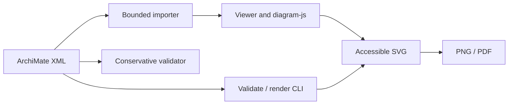
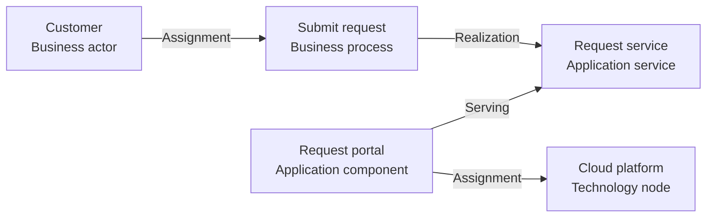

# archimate-js

A browser-based ArchiMate® diagramming library built on the [diagram-js](https://github.com/bpmn-io/diagram-js) engine from [bpmn.io](https://bpmn.io/).

ArchiMate® is a registered trademark of [The Open Group](https://www.opengroup.org/archimate-forum/archimate-overview).

See [third-party notices](THIRD_PARTY_NOTICES.md) for bundled font licenses, project provenance, and attribution.

## What is implemented today

The package entry point exports the default `Viewer` class, the named `mountViewer` and `renderViewToSvg` helpers, and the headless `routeViewConnections`, `optimizeDiagram`, and `applyLayoutPatch` geometry APIs from [`index.js`](index.js). See [diagram routing and reversible optimization](docs/layout/diagram-optimization.md) for usage and limits.

| Capability | Current implementation | Important boundary |
| --- | --- | --- |
| Import and render | Use `Viewer.importXML(xml, view?)` or mount selected views with `mountViewer({ xml, viewId/viewName, container })`. | XML/MEFF support is still being characterized; see the exchange-format status below. |
| Save model | Serialize the currently loaded model with `saveXML()`. | Do not assume complete cross-tool round-trip fidelity yet. |
| Export diagram | Export the current view with `saveSVG()`, render an accessible SVG string with `renderViewToSvg({ xml, viewId/viewName })`, or use the CLI for single-view SVG/PNG/PDF files. | Rendering requires a browser DOM; it is not a Node/server renderer or whole-model export. |
| Viewer navigation | Selection, canvas movement, zoom, touch, and keyboard navigation are included in the Viewer modules. | This is a diagram viewer API, not a claim that every editor workflow is exposed. |
| Read-only embedding | A locally served HTML example mounts the public Viewer API and loads a repository-owned synthetic fixture. | The example disables pointer input for presentation only; that is not an authorization or security boundary. |

The experimental `archimate-js/modeler` subpath exposes a public browser
`Modeler` facade for eligible DTO editing sessions, including lifecycle,
engine-neutral events, serializable edit commands, undo/redo, selection,
projection, save, and viewport helpers. It is documented in
[`docs/editor/modeler-api.md`](docs/editor/modeler-api.md); the diagram-js
escape hatch remains explicitly unstable.

Supported imports, deep-import policy, version channels, and release criteria are documented in the [release policy](docs/releases.md).

See the [read-only HTML example guide](docs/rendering/read-only-html-embed.md) for consumer integration notes.

## Architecture at a glance



The public package surface is intentionally small. Browser consumers mount a
selected view and can export it as SVG; the validator and CLI provide bounded
input checks and deterministic diagnostics. The modeler/editor code remains
internal and is not part of the root package API.

### What works today

This screenshot is generated from the checked-in, hand-authored synthetic
service-delivery fixture by the Playwright browser smoke test. It demonstrates
the rendering path and visible business, application, and technology elements;
it is not a screenshot of a customer model or evidence of full MEFF
interoperability.

The [CI runs on `main`](https://github.com/Tigon32/archimate-js/actions/workflows/ci.yml?query=branch%3Amain)
generate and validate the screenshot. Open the latest successful run and download
`read-only-showcase-screenshot` from its **Artifacts** section to inspect the PNG.

The sample includes these layers and relations:



Fixture provenance and safety checks are recorded in
[`test/fixtures/manifest.json`](test/fixtures/manifest.json). A real public
sample will be added only when its source and redistribution terms are reviewed
and recorded there.

## Exchange-format status

The repository is testing its XML handling against synthetic, schema-validated
MEFF 3.1 fixtures, but it does **not** yet claim full ArchiMate Model Exchange
File Format conformance, tool certification, or cross-tool portability.

Current supported import evidence covers a bounded subset:

- Model identity, localized names, elements, relationships, documentation, and
  relationship endpoint references from a synthetic fixture validated against
  the official MEFF 3.1 Model XSD.
- Diagram views, nested Element nodes, Relationship connections, diagram-space
  geometry, connection attachments/bendpoints, supported style fields, imported
  relationship labels, and rendered connection line width from a synthetic
  fixture validated against the official MEFF 3.1 Diagram XSD.
- Stable, content-free diagnostics for unsupported records and unresolved
  references.

`exportMeff(model)` and `viewer.saveMeff()` serialize this declared subset
deterministically, returning `{ xml, diagnostics }`. Missing or duplicate XML IDs
and unresolved mandatory references reject export. Unsupported optional fields
produce content-free `MEFF_EXPORT_*` omission diagnostics; callers must inspect
them before relying on an exchange. Synthetic model and diagram fixtures are
tested for semantic import/export/import equivalence and generated output is
checked against the pinned official MEFF 3.1 XSDs in CI. See the
[export profile](docs/standards/meff-export.md). Model metadata,
organizations, property definitions/properties, viewpoint definitions, local
diagram annotations/drill-down references, and non-Element/non-Relationship
presentation records are tracked as follow-up gaps from the P08 review. See the
[exchange-format alignment notes](docs/standards/model-exchange-alignment.md)
and [fixture provenance rules](test/fixtures/README.md).

### Report a suspected conformance or exchange-format gap

If a behavior appears inconsistent with The Open Group ArchiMate specification or its published exchange/conformance artifacts, [search existing issues](https://github.com/Tigon32/archimate-js/issues) and report a reproducible case with the [ArchiMate conformance issue template](.github/ISSUE_TEMPLATE/archimate-conformance.yml). Cite the authoritative source and include expected versus actual behavior, the package version and runtime, and a minimal `PUBLIC` or `SYNTHETIC` example. Do not attach private models, screenshots, customer data, names, hosts, or credentials.

Use this route for suspected language/notation defects and MEFF import/export or serialization gaps. An already documented unsupported feature is a limitation report unless new evidence shows behavior beyond that boundary. Consumer-specific modeling or presentation preferences are feature requests, not standards defects. The Open Group materials are normative; other tools are interoperability references only. See the [consumer reporting guidance](docs/rendering/read-only-html-embed.md#reporting-suspected-standards-gaps).

## Model quality tools

The package exposes a TypeScript validator at `archimate-js/validator`. It checks bounded XML input, a conservative model structure subset, references, and relationship vocabulary, then optionally runs caller-supplied organization quality rules. Its ArchiMate 3.2 relationship service returns `allowed`, `disallowed`, or `unsupported`; only explicitly reviewed rows are decided. It reports deterministic review suggestions and does not mutate the source. This is not XSD validation, a complete ArchiMate semantic matrix, a conformance claim, or an automatic repair workflow. See [the validator profile](docs/standards/validator-profile.md) and [relationship matrix](docs/standards/relationship-validation-matrix.md).

## Headless CLI

The package includes a CI-oriented `archimate-js` command. Validation emits deterministic JSON diagnostics and exits non-zero when the model has fatal errors:

```sh
npx archimate-js validate ./model.xml
```

Run the built-in lint rules against a model:

```sh
npx archimate-js lint ./model.xml
npx archimate-js lint ./model.xml --format json
```

Lint defaults to human output. Use JSON for stable machine-readable findings;
see [lint CLI output and exit codes](docs/lint/cli.md).

Render one selected view with an existing Chrome or Chromium installation:

```sh
CHROME_BIN=/usr/bin/chromium npx archimate-js render ./model.xml \
  --view-id view-id \
  --output ./view.svg
```

Export the same selected view to one or more formats in a single browser
session and render:

```sh
CHROME_BIN=/usr/bin/chromium npx archimate-js export ./model.xml \
  --view-name "Application landscape" \
  --format svg,png,pdf \
  --output-dir ./exports \
  --basename application-landscape \
  --scale 2 \
  --background '#ffffff' \
  --pdf-page-size A4 \
  --pdf-orientation landscape
```

Use `--view-name` in place of `--view-id` when names are unique, or `--chrome /path/to/chrome` in place of `CHROME_BIN`. The CLI does not download a browser or make model requests. Its browser context blocks all network traffic. The validate, render, and export JSON diagnostics omit model XML, model summaries, identifiers, local paths, parser details, browser exception text, and stacks. Models are validated before rendering. Text and binary outputs are written atomically, and a failed multi-format request restores or removes any files it changed.

The explicit `diff --format json` output includes DTO values and identifiers; see
the [diff disclosure warning](docs/editor/model-dto-diff.md) before sharing it.

PDF export requires an opaque background. The default is `white`; an explicit
`--background transparent` is rejected when PDF is requested. See
[single-view CLI export](docs/rendering/cli-export.md) for the complete option,
filename, diagnostic, and Phase 1 API contract.

From a source checkout, run `npm run compile` first and replace `npx archimate-js` with `node ./dist/cli/main.mjs` in these examples.

## Run and test locally

Use Node.js 22.12 or later. From the repository root, install dependencies and build the browser bundle:

```sh
npm install
npm run compile
```

In a terminal, start a loopback-only static server from the repository root:

```sh
python3 -m http.server 8000 --bind 127.0.0.1
```

Open <http://127.0.0.1:8000/examples/read-only/> in your browser. The example loads the checked-in, hand-authored synthetic service-delivery model across business, application, and technology layers and the bundle built at `.ci-build/archimate-js.js`. Keep the server running while you use the page. Do not open the HTML file directly with a `file:` URL; its same-origin model fetch will not work. Binding to `127.0.0.1` keeps this development server off your LAN.

To run the automated checks, use another terminal from the repository root:

```sh
npm test
npm run compile
npm run test:browser
```

The browser smoke test starts its own loopback server and checks the synthetic example in Chrome/Chromium. Install Chrome or Chromium separately and set `CHROME_BIN` to its executable path, for example `CHROME_BIN=/usr/bin/chromium npm run test:browser`. The browser is not downloaded during npm installation.

`--ignore-scripts` skips dependency install-time scripts; compile and test commands do not require those scripts.

## Development checks

Pull requests and pushes to `main` run CI on Node.js 22 and 24, plus a hosted Chrome browser smoke test. The checks cover package entry loading, security/logging guards, fixture safety and provenance, unit contracts, and compilation of the public entry point.
