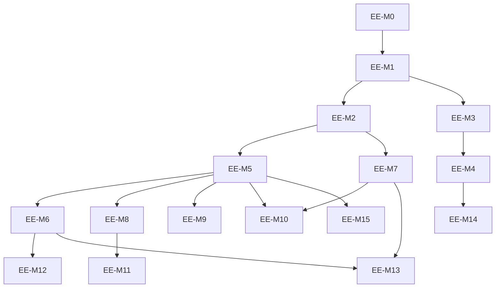

# Miro-like editor workstream: engine-neutral editing on diagram-js

Date: 2026-09-25
Status: Proposed plan

This is a planning document only. It defines a staged path for a richer
Miro-like editing experience while keeping `diagram-js` behind an
engine-neutral editor boundary. It does not implement a new editor, commit to
React, or change public APIs.

See [ADR-0010](../adr/0010-diagram-engine-boundary.md) for the architecture
decision record and [editor and design system roadmap](editor-and-design-system.md)
for the broader engine comparison and engine-switch gate.

## Current architecture

`diagram-js` 15.26.0 is the current diagram engine. `lib/BaseViewer.js`
extends diagram-js `Diagram`, and `lib/Modeler.ts` composes diagram-js editing
modules such as align-elements, auto-scroll, bendpoints, connect,
connection-preview, create, keyboard-move-selection, move, and resize, plus
ArchiMate features under `lib/features/*`.

The package root does not export `Modeler`. `index.js` exports `Viewer`,
`mountViewer`, `renderViewToSvg`, `routeViewConnections`, `optimizeDiagram`,
`applyLayoutPatch`, and `exportMeff`. `package.json` currently exposes `.`,
`./validator`, `./model-dto`, `./lint`, `./layout`, `./export`, and
`./app-shell.css`; there is no `./modeler` entry.

An engine-neutral foundation already exists in `src/model-dto/`:
`ModelDto`, `ViewDto`, `ViewNodeDto`, `ViewConnectionDto`, `ElementDto`,
`RelationshipDto`, `StyleDto`, `PointDto`, `DiagramAdapter`, `CanvasPort`,
`EditorCommand`, and `EditorEvent`. `DiagramAdapter` owns validated DTO state,
snapshot undo/redo, `project(viewId)`, `attach(viewId, port)`, `select`,
`execute`, `undo`, and `redo`. `DiagramJsCanvasPort` bridges diagram-js
gestures to DTO commands. It supports multi-node moves and multi-delete while
still rejecting reparenting. `DtoModelerSession` opens a DTO editing session over a
legacy `Modeler` import and saves MEFF XML plus DTO JSON.

The main architectural debt is dual state. The legacy path attaches moddle
business objects to diagram-js shapes (`businessObject`) and
`BaseViewer.saveXML()` serializes moddle. DTO sessions hold an independent
validated model. The target is one authoritative DTO state for eligible
editing sessions, with moddle as a compatibility adapter for unsupported
imports and diagram-js elements as transient projections.

## Target architecture

Dependency direction is one way:

```text
ArchiMate domain / model DTOs
        ↓
engine-neutral editor API and application intents
        ↓
DiagramJsAdapter / CanvasPort implementation
        ↓
diagram-js services and modules
```

The reverse dependency is prohibited. Domain, validation, layout, lint, export,
and future shell code must not import diagram-js or consume diagram-js service
objects.

| Layer | Responsibility |
| --- | --- |
| ArchiMate domain model | Own semantic elements, relationships, relationship decisions, DTO validation, MEFF eligibility, and business-object identity. |
| Editor/application layer | Expose product operations, lifecycle, events, selection, undo/redo, save, and shell-facing services over DTOs. |
| Diagram-engine abstraction | Define canvas projection, commands, events, viewport/layout/routing capabilities, and contract tests. |
| diagram-js adapter | Translate projection and editor commands to diagram-js modules, services, gestures, and transient visuals. |
| Engine-specific UI behavior | Implement lasso, hand tool, zoomscroll, drag handles, snapping, connector previews, and other canvas affordances behind the adapter. |

The API derives from product requirements and evolves the existing
`DiagramAdapter`, `CanvasPort`, and `EditorCommand` types. It is not a new
generic diagram framework. A conceptual `DiagramEngine` can have a
`DiagramJsAdapter` now and a possible future `ReactFlowAdapter`, but only the
diagram-js path is in scope for this workstream.

Optional capability interfaces should stay narrow:

| Capability | Purpose |
| --- | --- |
| `DiagramEngine` | Open/detach a view, render a projection, surface commands and selection. |
| `DiagramViewportCapabilities` | Fit view, fit selection, zoom, pan, viewport bounds, and minimap integration. |
| `DiagramLayoutCapabilities` | Apply reversible layout patches and visual preview transactions. |
| `DiagramRoutingCapabilities` | Route connections and expose bendpoint editing affordances. |
| `DiagramJsCapabilities` | Explicit unstable escape hatch for engine-specific diagnostics or advanced integrations. |

Prohibited leaks outside the adapter are `elementRegistry`, `commandStack`,
diagram-js shape and connection instances, canvas internals, and diagram-js
event objects.

### Operation boundary

| Operation | Boundary behavior |
| --- | --- |
| Load/open view | Application opens a DTO model and view through the editor service; adapter receives a projection. |
| Create concept | Intent creates an `ElementDto` and `ViewNodeDto`; adapter renders the node. |
| Create relationship | Intent creates a validated `RelationshipDto` and `ViewConnectionDto`; adapter renders the connection. |
| Move / resize | Editor command mutates DTO geometry; adapter may use engine transactions only for transient visuals. |
| Delete | Selection deletion maps to serializable DTO commands; semantic deletion policy remains explicit. |
| Select / multi-select | Selection is ephemeral editor state emitted through engine-neutral events. |
| Update label/name | Label edits affect view presentation; name edits affect semantic DTO concepts. |
| Apply layout patch | Layout services produce reversible `LayoutPatch`; editor applies it as one undoable command. |
| Fit view / zoom / pan | Viewport capability, not persistent model state. |
| Undo/redo | DTO history is authoritative for persistent edits in DTO sessions. |
| Editor events | Engine-neutral `changed` and `selection` events, later extended with stable typed events. |

## ADR-0010 decisions in brief

ADR-0010 records these decisions:

1. Keep `diagram-js` for the current editor roadmap.
2. Put all diagram-js access behind an engine-neutral editor boundary.
3. Make DTO sessions authoritative for persistent eligible edits.
4. Treat moddle as legacy compatibility for ineligible imports.
5. Route product operations through serializable editor commands.
6. Keep ArchiMate semantics in domain services, not engine rules.
7. Expose `Modeler` through a new experimental package subpath.
8. Define objective gates before considering a future engine migration.

## Public Modeler API

Add a new subpath when implementation starts:

```ts
import Modeler from 'archimate-js/modeler';
```

The public lifecycle should be create/attach/import/open/destroy:

| Area | Planned API shape |
| --- | --- |
| Create | Construct a modeler/editor instance with a container, services, and optional feature flags. |
| Attach | Attach to or detach from a DOM container without exposing canvas internals. |
| Import/open | `importXML(...)` for legacy XML and `open(...)` for DTO/MEFF-eligible sessions. |
| Save | Save through DTO session APIs returning MEFF XML and DTO JSON for eligible sessions. |
| Events | Subscribe to engine-neutral editor events, including changed and selection. |
| Operations | Create, connect, move, resize, delete, label/name/property edits, layout, viewport actions, undo/redo. |
| Destroy | Dispose listeners, ports, engine modules, and DOM ownership deterministically. |

Version policy follows [docs/releases.md](../releases.md): this repository is
still `0.y.z`, so the `modeler` subpath is experimental and breaking changes
may occur before `1.0.0` when called out in the changelog. The subpath must
ship TypeScript declarations and a packed-consumer test.

| API class | Examples | Stability |
| --- | --- | --- |
| Stable public | `archimate-js/modeler`, lifecycle, save, events, supported editor operations, DTO command/value types. | Experimental while `0.y.z`, but intended public boundary. |
| Adapter-internal | `DiagramJsCanvasPort`, `DtoModelerSession`, raw port services, gesture translation. | Move out of `archimate-js/model-dto`; re-export temporarily with deprecation. |
| Engine-specific escape hatch | `modeler.engine('diagram-js')` or `getDiagramJsCapabilities()`. | Unstable, opt-in, not portable, never required for normal editing. |

`DiagramJsCanvasPort` and `DtoModelerSession` now live in
`src/diagram-js-adapter/`. EE-M3 keeps deprecated compatibility re-exports from
the engine-neutral `archimate-js/model-dto` entry until the EE-M4 modeler entry
is introduced.

**EE-M7 status:** Implemented. Element-to-element RuleProvider decisions use
the shared domain relationship service: reviewed `allowed` tuples pass,
reviewed `disallowed` tuples are rejected, and `unsupported` tuples defer to
the strict DTO command for a structured diagnostic. Relationship/junction
endpoint and note/line behavior remains diagram-js structural compatibility,
not an expanded semantic profile. The reviewed service is a conservative
23-row subset; broader registry/profile work remains under #102, with
diagnostic feedback from #333.

## Miro-like canvas interaction

**EE-M8 status:** Implemented. The legacy diagram-js modeler now composes the
viewport/selection interaction pack for wheel and trackpad pan/zoom,
Ctrl+wheel browser pinch zoom, Space+drag temporary hand pan, Shift-drag
lasso selection, Shift-click multi-select, delete/backspace, Escape, select-all,
fit-view, and fit-selection shortcuts. The `archimate-js/modeler` facade exposes
engine-neutral viewport operations and plain viewport events. Multi-select
persistent editing, including batch move/delete, arrives through EE-M5 (#347).

The interaction pack should reuse diagram-js services where they fit:
lasso-tool, hand-tool, zoomscroll, keyboard, align/distribute, snapping, and
related interaction modules. A minimap package may be evaluated only after a
license and provenance check.

Target interactions:

| Interaction | Boundary rule |
| --- | --- |
| Smooth pan/zoom, trackpad pinch, space+drag pan | Viewport capabilities implemented by diagram-js integration. |
| Marquee and shift multi-select | Selection events remain engine-neutral IDs. |
| Keyboard navigation, delete/backspace | Commands flow through editor service; focus behavior is tested in browser. |
| Copy/paste and alt-drag duplicate | Produce DTO create/batch commands, not cloned engine objects. |
| Align/distribute, snapping/grid | Engine may provide UI affordances; persistent result is DTO geometry. |
| Context toolbar and selection handles | Shell requests operations through editor API; adapter owns engine widgets. |
| Quick connector handles | Adapter gesture asks domain service for valid relationships. |
| Undo/redo UX | DTO history is authoritative for saved edits. |
| Fit-to-selection, fit-to-view, optional minimap | Viewport capability; no semantic state. |

Multi-select edits route through DTO `move-many` and `delete-many` commands;
reparenting remains outside the supported persistent command boundary.

## Modern concept creation

**EE-M9 status:** Implemented. Double-clicking blank canvas opens the
registry-backed concept picker at the pointer. It searches Business,
Application, Technology, Strategy, Motivation, Physical, and Implementation &
Migration concepts, creates semantic elements and view nodes through the DTO
`create-element` command, and immediately edits the semantic name. IDs are
deterministic and collision-checked; the adapter converts pointer coordinates.
The static palette remains available as a secondary workflow.

The flow uses domain concepts rather than renderer shape definitions and
depends on #332 for DTO-owned creation commands.

## Smart relationship creation

**EE-M10 status:** Implemented. The Modeler facade derives connection choices
from the shared 23-row semantic profile, defaults only an unambiguous allowed
relationship, presents a keyboard-operable chooser for multiple valid types,
and displays separate counts for explicitly disallowed and unsupported types.
An empty-canvas connector drop opens a filtered target-concept chooser. The
target, view node, relationship, and connection are committed through one
validated `create-related-element` command; cancellation mutates nothing, and
the newly created semantic name can be edited immediately. See the
[relationship chooser contract](../editor/relationship-chooser.md).

## View/model separation

Definitions:

| Term | Definition |
| --- | --- |
| Model | Persistent ArchiMate DTO containing semantic concepts, views, diagnostics, and metadata. |
| Semantic element | `ElementDto`, a model concept such as an application component or business actor. |
| Semantic relationship | `RelationshipDto`, a model relationship with source and target semantic concept IDs. |
| View | `ViewDto`, a named diagram containing view nodes and view connections. |
| View node | `ViewNodeDto`, one presentation of a semantic element, container, or label in a view. |
| View connection | `ViewConnectionDto`, one presentation of a relationship or line in a view. |
| Presentation/style | Geometry, waypoints, labels, and `StyleDto` values attached to view objects. |
| Renderer-specific representation | Transient diagram-js shape/connection, SVG data, handles, overlays, markers, and events. |

`ElementA` can appear in `View A` as `ViewNode A1` and in `View B` as
`ViewNode B1`. Geometry, labels, and style never define semantic identity.

## Engine-neutral view representation

Existing DTO fields cover most view needs:

| Need | Existing field |
| --- | --- |
| View identity and name | `ViewDto.id`, `ViewDto.name` |
| Node identity and kind | `ViewNodeDto.id`, `kind` |
| Semantic element reference | `ViewNodeDto.elementId` |
| Legacy/import references | `conceptRef`, `xpathPart` |
| Node geometry | `x`, `y`, `width`, `height` |
| Nested nodes | `ViewNodeDto.nodes` |
| Node label/style | `label`, `style` |
| Connection identity and kind | `ViewConnectionDto.id`, `kind` |
| Semantic relationship reference | `relationshipId` |
| Connection endpoints | `sourceId`, `targetId` |
| Connection route | `waypoints: PointDto[]` |
| Connection label/style | `label`, `style` |

Known gaps include explicit label position, text layout metadata, port/anchor
identity beyond waypoint `kind`, viewport state, z-order beyond tree/order
position, and richer renderer hints. Add them to DTOs only when a product
operation requires persistent data.

`ModelDto` is authoritative in DTO sessions. The architecture must not create
three independent states: moddle, diagram-js elements, and a separate
application view model. During migration, moddle remains a compatibility
adapter for ineligible imports. Diagram-js elements are transient projections.
EE-M13 converges the legacy save path with DTO authority.

## Editing command boundary

Application intents map to discriminated, serializable, deterministic
`EditorCommand` values executed by one service, `DiagramAdapter`.

| Application intent | Existing or planned command |
| --- | --- |
| `CreateElement` | Pending #332; not part of the EE-M5 batch/layout slice. |
| `CreateRelationship` | Existing `connect` partially covers this; needs creation intent support. |
| `MoveViewNode(s)` | Existing `move` for one node; `move-many` implemented for absolute-coordinate batch moves. |
| `ResizeViewNode` | Existing `resize` |
| `DeleteSelection` | Existing `delete` for one item; `delete-many` implemented for batch selection delete. |
| `ChangeElementName` | Existing `concept-name` |
| `ApplyLayoutPatch` | `apply-layout-patch` implemented for reversible DTO layout geometry patches. |
| Composite operations | Gap: batch/`transaction` command |

Decision: use DTOs plus one editor service. Do not introduce another command
framework. The diagram-js `commandStack` may remain inside the adapter for
transient visual transactions where needed, but DTO history is authoritative
for persistent edits in DTO sessions.

## Layout

Keep the existing layout functions: `optimizeDiagram`,
`routeViewConnections`, and `applyLayoutPatch`. The public modeler facade now
commits optimization via a DTO `apply-layout-patch` command (EE-M6); direct
legacy `Modeler.optimizeDiagram` retains commandStack compatibility.

`src/layout/types.ts` already defines `LayoutOptions.strategy` as `'builtin' |
'elk-layered'`, plus `LayoutPatch` and `LayoutResult`. ELK.js belongs behind
the existing `src/layout` strategy boundary and must be coordinated with #100.
Its package license expression is `EPL-2.0 OR GPL-3.0-or-later`, so the chosen
license path needs review before distribution. The license/provenance
prerequisite review is recorded in
[`docs/research/elkjs-license-and-provenance.md`](../research/elkjs-license-and-provenance.md)
(#374).

All layout strategies should produce common reversible `LayoutPatch` values.
Layouts are geometry-only, undoable, and must not persist diagram-js engine
state.

## Rendering projection

The desired flow is:

```text
DiagramAdapter.project(viewId)
        ↓
CanvasProjection
        ↓
DiagramJsCanvasPort.render(projection)
        ↓
diagram-js transient shapes and connections
```

Transient renderer data is allowed inside the adapter. It must not become the
source of persistent model truth.

Dependency reversals or legacy couplings today:

| Current place | Reversed dependency | Refactoring milestone |
| --- | --- | --- |
| `lib/import/Importer.js` and legacy import path | Builds diagram-js/moddle objects directly from XML. | EE-M13 |
| `BaseViewer.saveXML()` | Serializes moddle mutated by legacy command handlers. | EE-M13 |
| `lib/features/modeling/cmd/*` | Mutates moddle/businessObject state through diagram-js commands. | EE-M13 |
| `lib/Modeler.ts` | Direct legacy `optimizeDiagram` reads `canvas`, `elementRegistry`, and executes `commandStack`; the public facade uses DTO layout intents. | EE-M6 (legacy compatibility retained) |
| `lib/features/rules/ArchimateRules.js` | Engine gesture compatibility checks remain in the RuleProvider; semantic tuple decisions use the domain service. | EE-M7 (implemented) |
| Renderer and feature modules reading `businessObject` | Rendering depends on moddle objects attached to shapes. | EE-M13 |

## Application shell

The shell should contain repository/model tree, search, views list, canvas,
properties inspector, validation/lint panel, layout controls, export, and
import. It talks to the editor service and DTO/domain APIs, never to
diagram-js services.

There is no React in the core library today. The app shell is vanilla plus CSS
tokens; see [app shell styles](app-shell-styles.md). Adding React to the core
library requires a separate ADR. React may be evaluated for a separate shell
without implying React Flow or an engine migration.

## Collaboration readiness

No distributed collaboration is in scope now. Prepare by keeping
`EditorCommand` deterministic and serializable, with extension points for
presence, cursors, collaborative selection, shared editing, operation sync, and
conflict resolution. Synchronize semantic and view operations, not canvas
state. Deterministic ID generation is required before any operation log can be
shared or replayed across clients.

## Future React Flow path

A future React Flow migration would keep DTO/domain services, command
semantics, validation, layout patches, export, and lint, while replacing the
diagram-js adapter and shell integration. The criteria for starting that work
are intentionally high:

- a concrete product requirement cannot be met economically on diagram-js;
- the requirement is validated against the
  [engine-switch gate](editor-and-design-system.md#engine-switch-gate);
- the [React Flow migration path](../editor/react-flow-migration-path.md)
  prototype passes the same DTO command, import/export, accessibility, browser,
  undo/redo, and layout tests as the diagram-js adapter;
- license, bundle, browser support, and distribution impacts are reviewed.

Do not migrate because another library has a stronger brand, React examples, or
a longer feature list.

## Architectural invariants

1. **INV-1:** Domain, validation, layout, lint, export, and shell code do not
   import diagram-js or depend on diagram-js service names.
2. **INV-2:** Persistent editor state in DTO sessions is `ModelDto`, not
   diagram-js elements.
3. **INV-3:** Diagram-js shapes, connections, events, `elementRegistry`,
   `commandStack`, and canvas internals do not cross the adapter boundary.
4. **INV-4:** ArchiMate relationship decisions come from reviewed domain
   services, not renderer or gesture code.
5. **INV-5:** Editor operations are serializable deterministic DTO commands.
6. **INV-6:** Undo/redo for persistent edits is DTO history in DTO sessions.
7. **INV-7:** Layout changes are reversible geometry patches.
8. **INV-8:** View geometry, labels, and style never define semantic identity.
9. **INV-9:** Engine-specific escape hatches are unstable and optional.
10. **INV-10:** The existing diagram-js editor stays functional throughout the
    migration.

## Coupling hotspots

| File or area | Coupling | Target milestone |
| --- | --- | --- |
| `src/model-dto/index.ts` | Keeps deprecated compatibility re-exports for `DiagramJsCanvasPort` and `DtoModelerSession`; implementation moved to `src/diagram-js-adapter/`. | EE-M4 |
| `src/diagram-js-adapter/canvas-port.ts` | Adapter depends on canvas, eventBus, selection, modeling, and element factory services. | EE-M2, EE-M5 |
| `src/diagram-js-adapter/modeler-session.ts` | DTO session is coupled to legacy `Modeler` services. | EE-M4 |
| `lib/Modeler.ts` | Composes diagram-js modules and routes optimize through canvas, elementRegistry, commandStack. | EE-M6 |
| `lib/BaseViewer.js` | Extends diagram-js `Diagram` and owns legacy viewer lifecycle. | EE-M13 |
| `lib/import/Importer.js` | Imports XML into moddle/diagram-js projection. | EE-M13 |
| `lib/features/modeling/cmd/*` | Legacy command handlers mutate `businessObject` state. | EE-M13 |
| `lib/features/rules/ArchimateRules.js` | Retains structural gesture checks while delegating semantic tuple decisions. | EE-M7 (implemented) |
| `lib/draw/*` and renderer features | Renderer reads `businessObject` on shapes. | EE-M13 |
| `lib/layout/optimize-diagram.mjs` | Legacy layout patch applies through diagram-js command context. | EE-M6 |

## Risks

| Risk | Likelihood | Impact | Mitigation |
| --- | --- | --- | --- |
| Boundary becomes too generic and slows feature work. | Medium | Medium | Derive API from concrete editor operations, not abstract engine ideals. |
| Dual moddle/DTO state causes save divergence. | High | High | Keep DTO sessions explicit; converge save path in EE-M13; fail closed on ineligible imports. |
| Moving exports breaks early adopters. | Medium | Medium | Use re-export deprecation in EE-M3 and document migration. |
| Multi-select/batch commands introduce nondeterminism. | Medium | High | Make commands serializable, ordered, validated, and covered by headless contract tests. |
| Gesture affordances disagree with domain validation. | Medium | High | RuleProvider delegates to the domain service in EE-M7; unsupported edits remain strict at the DTO boundary. |
| ELK.js licensing blocks distribution. | Medium | Medium | Review license path before implementation; keep strategy optional. |
| Miro-like interactions leak engine objects into shell. | Medium | High | Enforce import boundaries and contract tests before UI work scales. |
| Engine escape hatch becomes de facto public API. | Medium | Medium | Mark unstable, test public APIs without it, and avoid docs examples that require it. |
| Existing editor regresses during migration. | Medium | High | Keep diagram-js path functional; add browser and packed-consumer checks per milestone. |
| Collaboration assumptions leak into current APIs. | Low | Medium | Prepare command determinism only; do not add sync framework now. |

## Testing and architecture enforcement

Test areas:

- modeler package exports, TypeScript declarations, and packed consumer;
- engine contract tests against a headless fake port and `DiagramJsCanvasPort`;
- adapter behavior for rendering, commands, events, detach, and cleanup;
- concept creation from registry and create-at-pointer flow;
- relationship validation, chooser behavior, direction clarity, and connection
  creation;
- undo/redo, copy/paste, keyboard, delete/backspace, multi-select, and
  browser interactions;
- layout apply/reverse and XML/MEFF/DTO round trips;
- accessibility for focus, names, keyboard navigation, and semantic outline;
- backward compatibility of viewer, export, CLI, layout, lint, and validator
  entry points.

Enforcement should add an architecture import rule, either through ESLint
`no-restricted-imports` or by extending `scripts/check-source-policy.mjs`.
Forbid `diagram-js/*` imports and diagram-js service names such as
`elementRegistry`, `commandStack`, `eventBus`, and `canvas` in
`src/model-dto` except adapter files, plus `src/language`, `src/validator`,
`src/layout`, `src/lint`, `src/export`, and the future shell. Allowed
exceptions are `lib/**`, the diagram-js adapter module, and tests.

### EE-M1 implemented import-boundary check

EE-M1 is implemented by `scripts/check-engine-boundary.mts`, available through
`npm run check:engine-boundary`, `npm run check:source-policy`, `npm test`, and
`npm run verify:wip`. The check scans engine-neutral `src/model-dto`,
`src/language`, `src/validator`, `src/layout`, `src/lint`, `src/export`, and
future clean shell/support roots (`src/cli`, `src/coordination`,
`src/verification`) for direct `diagram-js*` import specifiers, dynamic imports,
CommonJS `require` calls, re-exports, and string-literal lookups of diagram-js
services including `elementRegistry`, `commandStack`, `canvas`, `eventBus`,
`elementFactory`, `modeling`, `selection`, and `graphicsFactory`.

The explicit exception is `src/diagram-js-adapter/**`, the EE-M3 adapter home
where engine-specific dependencies belong. `lib/**` and `test/**` remain out
of scope for this architecture boundary check.

The contract test suite must run against any `CanvasPort`: a headless fake port
for deterministic service behavior and `DiagramJsCanvasPort` for browser
integration.

## Deliverables

The existing diagram-js editor must stay functional throughout.



| ID and title | Objective | Architectural rationale | Affected areas | Expected files/modules | Dependencies | Test strategy | Acceptance criteria | Migration/compatibility concerns | Complexity |
| --- | --- | --- | --- | --- | --- | --- | --- | --- | --- |
| EE-M0 Record ADR-0010 and this plan (docs only) | Record decisions and milestone plan. | Align parallel docs before implementation. | Docs. | `docs/adr/0010-diagram-engine-boundary.md`, this file. | ADR-0010, React Flow note. | Documentation review. | Links resolve; no implementation changes. | None. | S |
| EE-M1 Architecture import-boundary check | Add automated import/service-name guard. | Prevent new reverse dependencies. | Source policy, lint/test. | `scripts/check-source-policy.mjs` or ESLint config, tests. | EE-M0. | Run source-policy checks and negative fixtures. | Forbidden diagram-js imports fail outside allowed areas. | Allow existing `lib/**` and adapter exceptions. | S |
| EE-M2 Engine contract test suite (headless fake port + DiagramJsCanvasPort) | Implemented by the reusable CanvasPort contract suite in #344. | Make adapters interchangeable by contract. | DTO editor, adapter, tests. | `test/contract`, `test/browser`, `src/model-dto`. | EE-M1. | Headless fake port plus browser port tests. | Render, command, selection, detach, undo/redo behavior is covered. | Must not require React or new engine. | M |
| EE-M3 Relocate diagram-js adapter out of engine-neutral model-dto entry (with re-export deprecation) — Implemented | Move `DiagramJsCanvasPort` and `DtoModelerSession` exports behind modeler/adapter area. | Keep `model-dto` engine-neutral. | Package exports, DTO index, docs. | `src/model-dto/index.ts`, future modeler entry, docs/releases notes. | EE-M1. | Package export and packed-consumer tests. | Old re-export warns/deprecates; new path works. | Deprecation window for early users. | M |
| EE-M4 Public `archimate-js/modeler` entry, lifecycle, events, TypeScript declarations, packed-consumer test — Implemented | Expose experimental public modeler API. | Move consumers from internal paths to supported boundary. | Package exports, declarations, modeler facade. | `package.json`, `dist/modeler`, tests, docs. | EE-M3. | `test/smoke/package.test.mts`, packed consumer, type checks. | `import Modeler from 'archimate-js/modeler'` works. | Experimental under `0.y.z`; changelog must call breaks. | L |
| EE-M5 Editor intents: batch/multi-select move/delete and apply-layout-patch implemented; create-element remains with #332 | Add missing serializable commands. | Support Miro-like editing without engine state. | DTO adapter, commands, validation, tests. | `src/model-dto/editor.ts`, `src/model-dto/editor-view.ts`, DTO types if needed. | EE-M2, #332 for creation. | Unit contract tests and browser gesture tests. | Multi-node move/delete, batch, and layout patch are undoable; create-element remains pending #332. | Preserve single-item command behavior. | L |
| EE-M6 Route Modeler.optimizeDiagram through DTO apply-layout-patch — Implemented for eligible facade sessions | Make optimization use DTO authority. | Layout changes become reversible DTO edits. | Public modeler facade, layout, adapter. | `src/modeler/index.ts`, `src/layout`, adapter command. | EE-M5; #100 still defines advanced layout. | Layout apply/reverse tests and browser optimize smoke. | Optimize returns patch/metrics and commits through DTO command when eligible. | Direct legacy Modeler commandStack path remains; no ELK dependency included. | M |
| EE-M7 Domain-authoritative relationship rules in diagram-js RuleProvider (with #102/#333) | Make live gesture affordance use domain decision service. | Remove duplicate relationship authority. | Rules, language services, tests. | `lib/features/rules/ArchimateRules.js`, generated utility path, `src/language`. | EE-M2, #102, #333. | Relationship matrix/projection tests plus browser connect tests. | Allowed/disallowed/unsupported decisions are consistent in UI and DTO adapter. | Legacy generated util can remain only as projection of domain service. | M |
| EE-M8 Viewport & selection interaction pack (pan/zoom/pinch/space-drag/marquee/fit) | Add core whiteboard navigation and selection. | Keep canvas behavior adapter-local. | Diagram-js integration, keyboard/focus tests. | Modeler adapter modules, browser tests. | EE-M5, #97, #107. | Playwright focus/interactions and performance smoke. | Pan, zoom, pinch, space-drag, marquee, fit-to-view/selection work without leaking engine objects. | Preserve existing keyboard shortcuts. | M |
| EE-M9 Searchable concept picker & create-at-pointer | Add modern concept creation workflow. | Creation starts from domain registry. | Shell/editor UI, concept registry, commands. | `src/language/concept-registry.mts`, `src/modeler/concept-picker.ts`, `src/diagram-js-adapter/concept-picker.ts`, tests. | EE-M5, #332. | Unit search tests and browser create-at-pointer/semantic-name/MEFF round-trip test. | Double-click search creates semantic element and view node, then edits semantic name. | Palette remains supported as secondary workflow. | M |
| EE-M10 Smart relationship chooser & quick-create — Implemented in #352 | Use the domain decision service for live connection choice and quick-create. | Keep relationship semantics authoritative in the domain and commit quick-create atomically. | Modeler UI, diagram-js event adapter, DTO command/log, tests and docs. | `src/modeler/relationship-chooser.ts`, `src/diagram-js-adapter/canvas-port.ts`, `src/model-dto/editor-create.ts`, `src/model-dto/editor-operation-log.ts`. | EE-M5, EE-M7, #333, #102. | Unit tri-state/command/replay tests and Chromium relationship/quick-create flows. | One allowed type defaults; multiple allowed types show an accessible chooser; unsupported and disallowed tuples receive distinct feedback; empty-canvas quick-create creates no orphan on cancel and is one undoable command. | Reviewed semantics remain a 23-row subset; no silent fallback or full-conformance claim. | L |
| EE-M11 Context toolbar, connector handles, alt-drag duplicate, align/distribute UX, optional minimap — Implemented in #353 | Add productivity interactions. | Advanced UI remains engine integration, shell uses editor API. | Diagram-js adapter UI, DTO commands, Modeler API. | `src/diagram-js-adapter/productivity-toolbar.ts`, `src/modeler/productivity.ts`, DTO editor and browser tests. | EE-M8. | Browser toolbar/connector/Alt-drag tests and unit command/replay tests. | Eligible element-node hierarchies duplicate through DTO commands and undo cleanly; align, distribute, delete, and existing connector handles retain DTO routing. | Container/label duplication awaits broader MEFF/DTO convergence; runtime minimap adoption is deferred to application-shell integration after the completed [license/provenance research](../research/minimap-license-and-provenance.md); copy/paste remains legacy behavior. | L |
| EE-M12 ELK.js layout strategy behind src/layout (implemented in #382) | Provide an explicit optional `elk-layered` strategy. | Layout engine is service-level, not editor-engine replacement. | Typed layout adapter, exact `elkjs@0.12.0`, EPL notice/provenance, tests. | `src/layout`, `docs/research/elkjs-license-and-provenance.md`, `THIRD_PARTY_NOTICES.md`, `licenses/elkjs-EPL-2.0.txt`. | EE-M6, #354, #374. | Synthetic layout, patch reversal, determinism, route and package-notice tests. | Nested graph and cross-hierarchy routing are mapped to DTO patches; explicit failures have no partial result; EPL-2.0 path is recorded and shipped. Labeled views receive a stable diagnostic until renderer-consumable label geometry is supported. | No worker/performance claim; see #385 and #386. See the license record for exact provenance and selected license path. | M |
| EE-M13 Converge legacy moddle save path with DTO authority (compat plan for ineligible imports) | Reduce dual state and clarify save semantics. | Persistent edits should not diverge. | Importer, saver, modeling commands, renderer. | `BaseViewer.saveXML`, `lib/import`, `lib/features/modeling/cmd`, DTO MEFF bridge. | EE-M6, EE-M7. | XML/MEFF round trips, browser edit/save tests, legacy compatibility tests. | Eligible edits save through DTO authority; ineligible imports retain legacy path with explicit diagnostics. | Highest-risk migration; keep legacy compatibility until evidence is strong. | XL |
| EE-M14 Application shell integration over editor service (tree, inspector, lint panel, layout controls) | Build shell features over editor/domain APIs. | Shell must not depend on diagram-js. | App shell, styles, lint/validation UI. | App shell modules, CSS tokens, docs. | EE-M4, #96, #104, #108, #136. | Browser shell tests, accessibility tests, package tests. | Tree, inspector, lint, layout controls, import/export work through editor service. | No React in core without separate ADR. | L |
| EE-M15 Collaboration-readiness: deterministic IDs & op log serialization (no sync) — Implemented in #357 | Prepare DTO operations for future collaboration. | Deterministic commands enable local replay later. | DTO commands, operation log, serialization/replay tests. | `src/model-dto/editor-operation-log.ts`, adapter tests, editor docs. | EE-M5. | Synthetic unit replay tests and deterministic serialization tests. | Versioned commands can be serialized/replayed deterministically for one client. | No network, presence, synchronization, or distributed conflict resolution. | M |

## Related issues and dependencies

This plan depends on existing roadmap issues without duplicating their scope:
#96 for core editor workflows, #97 for interaction and accessibility gates,
#100 for pluggable compound auto-layout, #102 for a single versioned semantics
registry, #104 for semantic accessibility, #107 for performance budgets, #108
for extension API boundaries, #329 for editable DTO profile, #332 for DTO-owned
creation commands, #333 for relationship validation feedback, and #136 for
themes.

## Public sources

- [`diagram-js`](https://github.com/bpmn-io/diagram-js), generic browser
  diagram toolkit.
- [React Flow documentation](https://reactflow.dev/), including custom nodes
  and edges.
- [ELK.js](https://github.com/kieler/elkjs), graph layout algorithms and
  package license expression.
